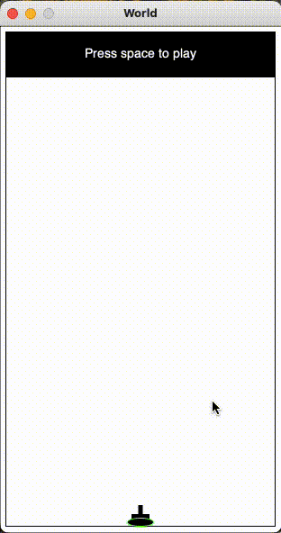
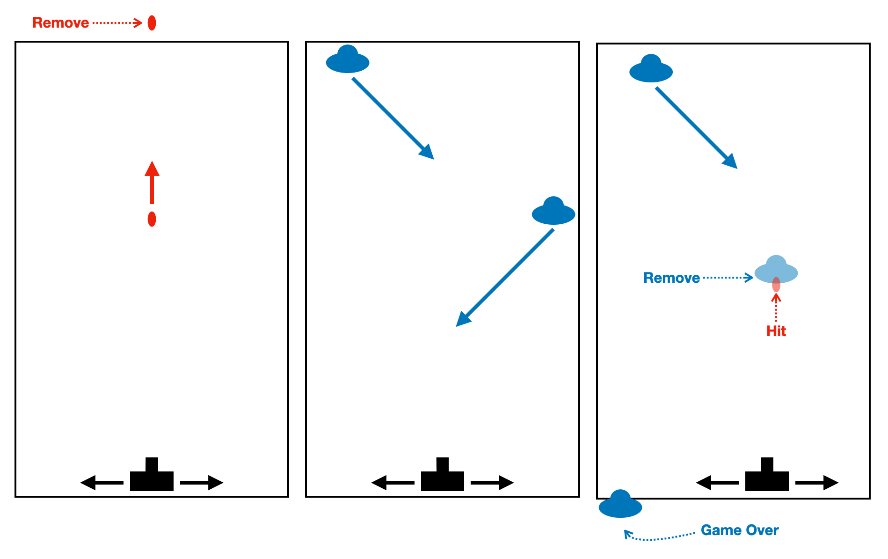
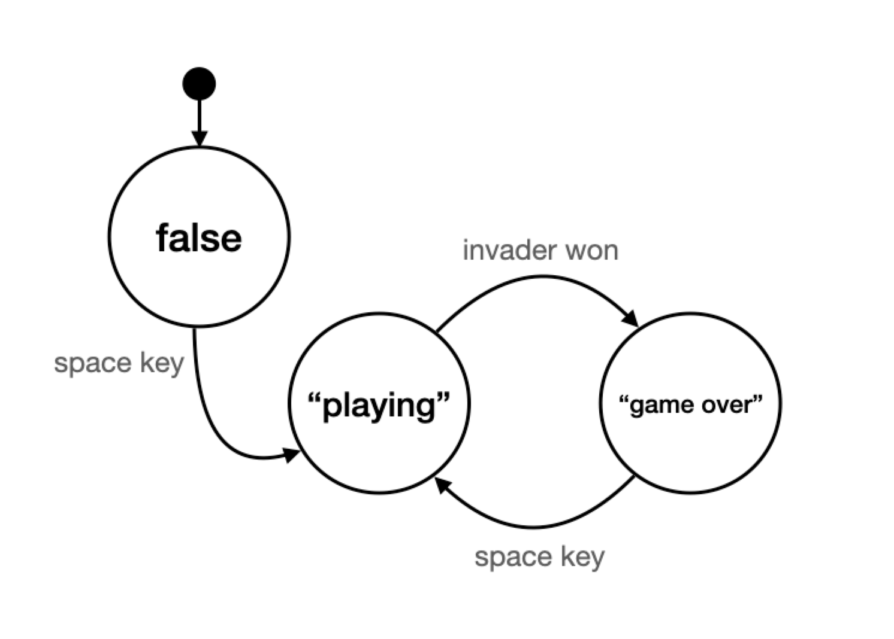

# Final project: Space Invaders

**[Click here to see my review of the full course](../README.md)**

> **Problem Statement:**  
> There are many different versions of Space Invaders. For this project, your Space Invaders game should have the following behaviour:
> - The tank should move right and left at the bottom of the screen when you press the arrow keys. If you press the left arrow key, it will continue to move left at a constant speed until you press the right arrow key.
> - The tank should fire missiles straight up from its current position when you press the space bar.
> - The invaders should appear randomly along the top of the screen and move at a 45 degree angle. When they hit a wall they will bounce off and continue at a 45 degree angle in the other direction.
> - When an invader reaches the bottom of the screen, the game is over. 

**[My Code]:** [space-invaders.rkt](https://github.com/zarry0/cs_curriculum/tree/main/Core_programming/HtC_simple_data/Final-project)

 

## Domain analysis

| Constants | Variables | Big-Bang options |
| --- | --- | --- |
| - Width & Height | - tank x coord | - on-tick
| - tank image  | - invaders x & y coords | - to-draw
| - invaders image | - missiles x & y coords \ a | - on-key 
| - missile image
| - background
| - tank speed
| - invaders speed
| - missile speed
| - tank y coord
| - font size and color 

## Modifications to Game data definition

On top of the requirements listed above, I wanted the game to start after pressing the space key, keep a score each time an invader gets destroyed, and re-start the game when the game is lost by pressing the space key again.

To achieve this, I modified the given Game data definition from this:

    (define-struct game (invaders missiles tank))
    ;; Game is (make-game  (listof Invader) (listof Missile) Tank)
    ;; interp. the current state of a space invaders game
    ;;         with the current invaders, missiles and tank position
To this:

    (define-struct game (invaders missiles tank score status))
    ;; Game is (make-game  (listof Invader) (listof Missile) Tank Natural Status)
    ;; interp. the current state of a space invaders game
    ;;         with the current invaders, missiles, tank position, current score and game status

Where "status" is defined as follows:

    ;; Status is one of:
    ;;  - false
    ;;  - "playing"
    ;;  - "game over"
    ;; interp. the current status of the game, where:
    ;;         false       means the game is yet to begin
    ;;         "playing"   means the player is playing the game
    ;;         "game over" means the player lost the game

Following this state machine that shows the different game states and their relationship between them.

## Progress steps

- Build render function
    - Render the scoreboard
    - Render the game scene
- Make the tank move
	- Keep the tank within the bounds of the screen
- Make the tank be able to shoot missiles
	- Remove the missiles that got out of the screen
- Spawn Invaders randomly
- Move Invaders
	- Make invaders bounce off of walls
- Check for collisions
	- Remove invader collisions
	- Remove missile collisions
	- Keep score
- Add Start and Game Over screens

